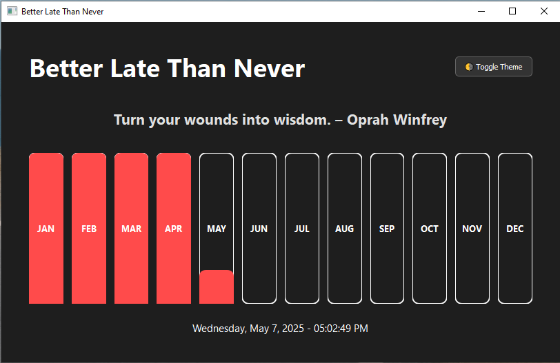
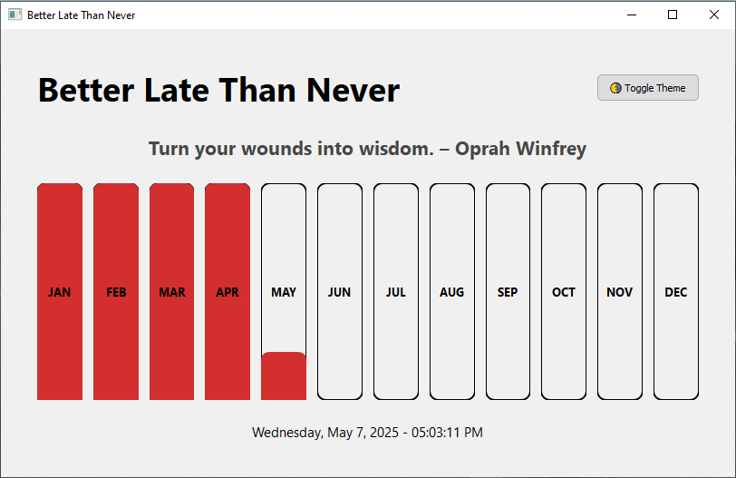

# **Better Late Than Never - Time Tracker**

The **"Better Late Than Never"** Time Tracker is a motivational app designed to help you track your progress throughout the year. With visual progress bars for each month, dynamic date and time, and inspirational quotes, this app reminds you that every day is a new opportunity to start fresh.


## **Features**

- **Monthly Progress Tracker**: Displays a bar for each month of the year, filling up progressively as the days pass.
- **Dynamic Date & Time**: Displays the current date and time with seconds, updating every second.
- **Motivational Quotes**: A new random quote appears each time, placed between the header and month bars.
- **Theme Toggle**: Switch between dark and light themes for a personalized experience.
- **Responsive Design**: Adapts the UI layout based on the window size.

## **Requirements**

To run the project, you'll need to have the following installed:

- **Python 3.x** (Preferably 3.8 or higher)
- **PyQt5** library (for building the GUI)

## **Installation**

To set up this app locally on your machine, follow these steps:

### 1. Clone the repository or download the `tracker.py` script:
```bash
git clone https://github.com/your-username/time-tracker.git
```

### 2. Navigate into the project directory:
```bash
cd time-tracker
```

### 3. Create and activate a virtual environment (optional but recommended):
  On Windows:
  ```bash
  python -m venv myenv
  myenv\Scripts\activate
  ```
   On macOS/Linux:
  ```bash
  python -m venv myenv
  source myenv/bin/activate
  ```

### 4. Install PyQt5:
```bash
pip install PyQt5
```

### 5. Run the app:
```bash
python tracker.py
```

## **Usage**

### 1. **Theme Toggle**:

You can toggle between light and dark themes by clicking the "🌗 Toggle Theme" button at the top of the window.

### 2. **Month Progress Bars**:

Each month of the year has a corresponding bar. The filled portion of the bar represents the progress made during that month, which fills up as the days go by.

### 3. **Quote Display**:

A motivational quote is displayed just below the year title and above the month bars. It refreshes each time the app is started.

### 4. **Date & Time**:

The current date and time are shown in real-time at the bottom of the window, updating every second.

## **Screen Shorts**

### Screen Short 1


### Screen Short 2


